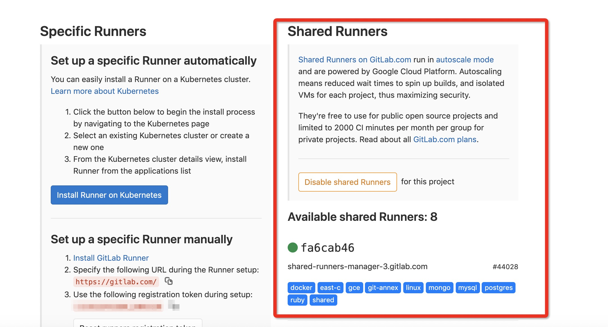
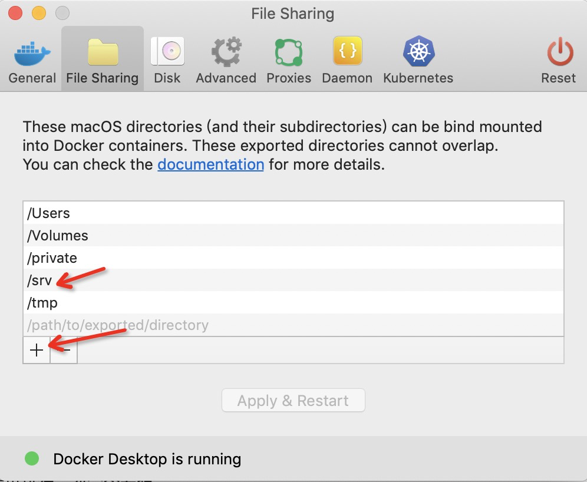
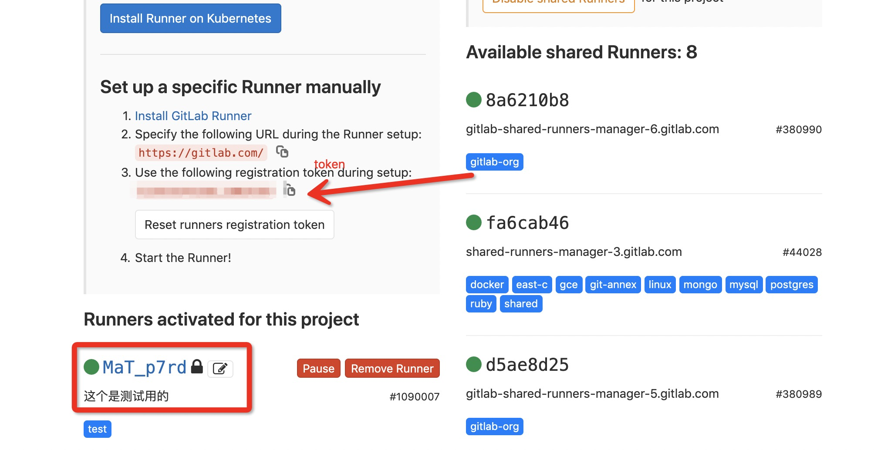

### SpringBoot 配合 Gitlab-ci 自动化构建

使用 `Gitlab-ci` 进行自动化构建减少发布的 `不稳定性` `省时`. 这里用 `git push` 后，执行单元测试为例.

使用前:

* 注册 `[Gitlab](https://gitlab.com)` 账号一个.

#### SpringBoot 单元测试

使用 `Idea` 搭建一个基本的 `SpringBoot` 应用 , 使用 `mybatis` 搭建基本的 `CURD`.

配置文件application.properties:

```text
spring.http.encoding.force=true
spring.http.encoding.charset=UTF-8
spring.http.encoding.enabled=true
        
server.port=8085
spring.application.name=springboot-ci-test
mybatis.config-location=classpath:/config/mybatis-configuration.xml
spring.main.allow-bean-definition-overriding=true
```

单元测试profile:application-dev.properties

```text
spring.datasource.url=jdbc:h2:mem:testdb
spring.datasource.driver-class-name=org.h2.Driver
spring.datasource.username=root
spring.datasource.password=123456
spring.datasource.schema=classpath:db/schema.sql
spring.datasource.data=classpath:db/data.sql
```

测试环境profile:application-test.properties
```
raycloud.datasource.url=jdbc:mysql://127.0.0.1:3306/test?useSSL=false&amp;useUnicode=true&amp;characterEncoding=UTF-8&allowMultiQueries=true
raycloud.datasource.username=root
raycloud.datasource.password=chenshun
```

基本的 `CURL`代码

```java
@Repository
public class UserDao {

    @Autowired
    private SqlSessionTemplate sqlSessionTemplate;
  
    public void delete() {
        List<Object> objects = sqlSessionTemplate.selectList("User.se");
        System.out.println(JSONObject.toJSONString(objects));
    }
  
    public void insert() {
        User user = new User();
        user.setPassword("111");
        user.setUsername("cccc");
        user.setStatus(1);
        sqlSessionTemplate.insert("User.insert", user);
    }
}
```

其他的细节可以参考 [gitlab-ci-test](https://gitlab.com/chenshun00/test) 代码.
本地 `MySql` 创建 `DB` 和 `库` 即可进行测试.

执行 `mvn test` 运行单元测试. 
出现 `Tests run: 1, Failures: 0, Errors: 0, Skipped: 0` 为测试通过.

#### Gitlab-ci

搭建完 `SpringBoot` 后，建立 `.gitlab-ci.yml` 文件，用于 `gitlab` 进行自动化构建 ， 本次作为一次粗制的介绍(一般也就是这么用了) , 更多的细节可参考 `搜索引擎`.

* 定义构建的阶段 `stages`
* 定义各个场景的 `Job`

因为我是后端开发，这里已一个基本的 `deploy` 以及 push后的 `单元测试` 为例. 

```yaml
#定义j，这里可以随意定义，尽量具有可读性即可
stages: 
  - install_deps
  - test
  - notifor
# 执行场景前的调用
before_script:
  - echo 'starter'
  - echo $CI_COMMIT_REF_NAME , $GITLAB_USER_EMAIL  $CI_COMMIT_MESSAGE, '执行构建的commit'
  - chmod +x mvnw
# 定义job
job0:
  # 使用的docker镜像 
  image: java:8
  # 阶段
  stage: install_deps
  # 什么时候会触发这个job，这里的含义是当master的readme.md发生变更之后
  only:
    refs:
      - master
    changes:
      - readme.md
  # job执行的脚本
  script:
    #    - ./mvnw clean install -Dmaven.test.skip=true
    - echo 'good'
  # 是否允许失败，true，失败之后会继续执行下一个。false(默认) 后续不执行，推出，本次构建失败
  allow_failure: true
# 参考job1克继续解释
job1:
  image: java:8
  stage: test
  # 只有当分支为 master 和 dev- 开头的分支才会执行这个job1
  only:
    - master
    - /^dev-.*$/
  script:
    - echo "$url"
    #    - ./mvnw test
    - echo 'good'
    - echo 'good'

通知:
  stage: notifor
  # job只有在失败的时候才会进行，如果job1成功，那么会跳过.
  when: on_failure
  script:
    - "curl 'https://oapi.dingtalk.com/robot/send?access_token=791c041c46412e98080b582e5a27aa1cb9b472f260f570222652deccbcc5df4a' \
      -H 'Content-Type: application/json' \
      -d '
      {\"msgtype\": \"text\",
       \"text\": {
         \"content\": \"执行单元测试失败通知\"
       }
      }'"
```

通过 `ci` 可以自动进行单元测试. 和 `发布系统` 结合还要合并到master的时候自动进行构建发布. 更多的场景需要我们自己挖掘.

例如:

* 调用 `deploy` 接口进行 deploy，执行自动化的单元测试
* `merge request` 的时候跑一次

#### 本地搭建Runner

`Gitlab` 提供了这一功能，但实际的构建过程是运行在 `Runner` 上的，一般而言 `Gitlab` 项目都会存在一个共享的 `Runner` ， 或者这个项目单独定义一个 `Runner`. 享受这个功能的时候使用共享的即可.



下面介绍如何在自己的机器上安装 `gitlab-runner` .

> 我是MacOS的环境，下面的讲解是基于MacOS进行的

* 安装并启动 `Docker`. 初学者建议参考 [菜鸟教程](https://www.runoob.com/docker/docker-tutorial.html) .
* 设置文件夹

```text
  sudo mkdir -p  /srv/gitlab-runner/config
  sudo chmod -R 777 /srv/
```

然后 `# ,` 打开 `Docker`, 添加文件到共享文件夹中， 如下图示:



执行启动脚本

```text
sudo docker pull gitlab/gitlab-runner
sudo docker run -d --name gitlab-runner --restart always  -v /srv/gitlab-runner/config:/etc/gitlab-runner     -v /var/run/docker.sock:/var/run/docker.sock     gitlab/gitlab-runner:latest
```

> 如果没有设置文件会提示失败. ---> /srv/gitlab-runner

如果提示:已经存在该名字的容器了,使用 `docker rm -f gitlab-runner` 删除该容器. 

如果一切正常. 使用 `docker ps` 即可观察到正在运行的进程. 将runner和 `Gitlab` 项目挂钩.

```text
sudo docker exec -it gitlab-runner gitlab-ci-multi-runner register --run-untagged
```

实际操作如下所示:

```text
➜  blog docker ps
CONTAINER ID        IMAGE               COMMAND             CREATED             STATUS              PORTS               NAMES
➜  blog sudo docker exec -it gitlab-runner gitlab-ci-multi-runner register --run-untagged
Password:
Error response from daemon: Container 1f4987bd55c49972e498da15cb1c37ad87fa156e66ee3857399d05450ade0670 is not running
➜  blog !2843
➜  blog docker run -d --name gitlab-runner --restart always \
  -v /srv/gitlab-runner/config:/etc/gitlab-runner \
  -v /var/run/docker.sock:/var/run/docker.sock \
  gitlab/gitlab-runner:latest
docker: Error response from daemon: Conflict. The container name "/gitlab-runner" is already in use by container "1f4987bd55c49972e498da15cb1c37ad87fa156e66ee3857399d05450ade0670". You have to remove (or rename) that container to be able to reuse that name.
See 'docker run --help'.
➜  blog  docker rm -f gitlab-runner
gitlab-runner
➜  blog docker run -d --name gitlab-runner --restart always \
  -v /srv/gitlab-runner/config:/etc/gitlab-runner \
  -v /var/run/docker.sock:/var/run/docker.sock \
  gitlab/gitlab-runner:latest
9255944acc6abc63a7c620ea59e3e86908d91290acdb03af380f2d82f72f0656
➜  blog docker ps
CONTAINER ID        IMAGE                         COMMAND                  CREATED             STATUS              PORTS               NAMES
9255944acc6a        gitlab/gitlab-runner:latest   "/usr/bin/dumb-init …"   5 seconds ago       Up 4 seconds                            gitlab-runner
➜  blog sudo docker exec -it gitlab-runner gitlab-ci-multi-runner register --run-untagged
Runtime platform                                    arch=amd64 os=linux pid=13 revision=a987417a version=12.2.0
Running in system-mode.

Please enter the gitlab-ci coordinator URL (e.g. https://gitlab.com/):
https://gitlab.com/
Please enter the gitlab-ci token for this runner:
界面的token
Please enter the gitlab-ci description for this runner:
[9255944acc6a]: 这个是测试用的
Please enter the gitlab-ci tags for this runner (comma separated):
test
Registering runner... succeeded                     runner=xjsGC5yY
Please enter the executor: kubernetes, shell, virtualbox, docker+machine, docker-ssh+machine, ssh, custom, docker, docker-ssh, parallels:

ERROR: Invalid executor specified
Please enter the executor: parallels, ssh, custom, docker, docker-ssh, docker-ssh+machine, kubernetes, shell, virtualbox, docker+machine:
shell
Runner registered successfully. Feel free to start it, but if it's running already the config should be automatically reloaded!
➜  blog
```

注册成功后，界面如下图



到这里就结束了，你也试试吧. :)