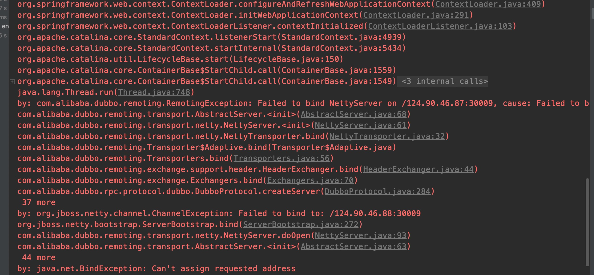

## Dubbo提供外网服务失败的原因

今天好几个同事都咨询了我为什么我的服务启动不了，不能绑定地址。为了解决这个问题，出现了本文，也给其他同学一个参考.

出错截图



重点:
> dubbo提供外网服务的前提是 anyhost=true,有外网IP. 没有的GG.
> InetSocketAddress bindAddress = new InetSocketAddress("0.0.0.0", bindPort);
> 参考redis提供外网服务绑定0.0.0.0

### Dubbo 2.4.9

出错的原因可能有
* anyhost=true没有设置
* 配置的dubbo:protocol不是dubbo导致的
* 配置必须保持一致或者是最总配置必须保持一致

```xml
<dubbo:protocol id="dubbo" name="dubbo">
        <dubbo:parameter key="anyhost" value="true"/>
</dubbo:protocol>
```

全局配置
> dubbo.protocol.port 配置会生效
> dubbo.protocol.host 配置会生效

局部protocol配置
> dubbo.protocol.(id).port 配置会生效
> dubbo.protocol.(id).host 配置会生效

强烈建议参考源代码:
>源代码参考AbstractServer构造方法

### Dubbo 2.6.2


开始区分绑定IP和注册IP，绑定端口和注册端口
绑定的IP和注册IP不一定相同，端口同理
获取绑定IP和注册IP

```java
private String getValueFromConfig(ProtocolConfig protocolConfig, String key) {
    String protocolPrefix = protocolConfig.getName().toUpperCase() + "_";
    String port = ConfigUtils.getSystemProperty(protocolPrefix + key);
    if (port == null || port.length() == 0) {
        port = ConfigUtils.getSystemProperty(key);
    }
    return port;
}
```

> DUBBO_DUBBO_IP_TO_BIND(DUBBO_IP_TO_BIND) ===> 绑定的IP
> DUBBO_DUBBO_PORT_TO_BIND(DUBBO_PORT_TO_BIND) ===> 绑定的端口

重点

**不能在配置了dubbo.protocol.host和dubbo.protocol.(id).host, 否则会报错.**

### 如何在本地复现 
* 必须配置anyhost=true..........
* 一个基本的Spring+tomcat的web应用

####  复现2.4.9

增加如下配置

移除anyhost并增加如下配置.

```text
-Ddubbo.protocol.dubbo.host=124.90.46.88
-Ddubbo.protocol.dubbo.port=30090
```
出现错误:
> Caused by: org.jboss.netty.channel.ChannelException: Failed to bind to: /124.90.46.88:30090

protocol配置变更为如下

```xml
<dubbo:protocol id="dobbo1" name="dubbo">
        <dubbo:parameter key="anyhost" value="true"/>
</dubbo:protocol>
```
启动成功，但是端口变更成为20880，直连GG,有人占用了这个端口也GG.失败原因见`AbstractConfig#appendProperties`

#### 复现2.6.2

增加如下配置
> DUBBO_PORT_TO_BIND某种意义上等同于dubbo.protocol.port,dubbo.protocol.(id).port,优先级会高.
> 
```text
-DDUBBO_PORT_TO_BIND=30009 
-DDUBBO_DUBBO_IP_TO_REGISTRY=124.90.46.87
-Ddubbo.protocol.host=124.90.46.88
-Ddubbo.protocol.port=30090
```
报错 不能绑定 124.90.46.88:30009


* 移除 -Ddubbo.protocol.host=124.90.46.88
 > lsof -i:30009 有进程 lsof -i:30090 GG

* 再次移除 -DDUBBO_PORT_TO_BIND=30009 
> lsof -i:30009 GG lsof -i:30090 有进程