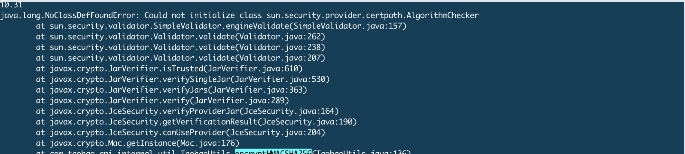

## Cloud not initialize class xxxxx

### 背景

最近开始从ECS迁移到K8S环境，Java运行环境统一升级到jdk1.8 & tomcat 8.0.32，迁移一阵以后，业务开始报错，`nested exception is java.lang.NoClassDefFoundError: Cloud not initialize class sun.security.provider.certpath.AlgorithmChecker`.



### 排错

拿到这个错误以后，开始在代码中搜索 `AlgorithmChecker` ， 一看是rt.jar的class，加载的classloader肯定是没有问题的. 一开始在日志中看到 `ClassCircularityError` 没有注意(其实这里才是导致这个异常的原因), 看到securiey以为是加解密的错误，但是在ECS上没有问题，于是写了一个jsp在测试环境开始调用，发现测试环境没有问题，意识到不是加解密的问题，又开始看日志，从 `catalina.out` 开始从头开始看，发现抛出 `ClassCircularityError` 还挺多的，这个错误是我们的安全组件抛出的，我们重写了 `SecurityManager` 用来保护自己，在google之后发现了 [第一次加载失败的类，在jvm里会被标记为initialization_error，再次加载时会直接抛出NoClassDefFoundError: Could not initialize class](https://blog.csdn.net/hengyunabc/article/details/71513509) 这篇文章才知道，原来是系统在加载 `sun.security.provider.certpath.AlgorithmChecker` 时因为安全组件的bug导致了循环加载的错误导致该类加载失败，但是jvm标记为加载了，而第二次需要谁用该class进行加解密的时候就引发了这个错误。

错误已经找到了，那么为什么会引发这个错误呢？看代码发现 `SecurityManager` 会对所有的操作进行 `check` ， 而其中的一些类(例如FilePermission)还没有加载，于是开始加载FilePermission，而加载FilePermission的时候又依赖FilePermission，这样就导致了一个循环依赖加载的错误。

修复的方式也很简单，如果是从rt.jar中读取的文件不进行校验，如果是tomcat的启动线程，并且启动时间小于60秒不进行检查. 这样就避免了这些错误的发生，代码提交，重发线上没有error. :)

```txt
private static boolean shouldSkip() {
    if (temp) return false;
    long timeMillis = System.currentTimeMillis();
    boolean x = timeMillis - time > 60 * 1000;
    if (x) {
        temp = true;
    }
    return true;
}
    
@Override
public void checkPermission(Permission perm) {
    try {
        if (Thread.currentThread().getName().contains("startStop") && shouldSkip()) {
            return;
        }
        if (perm.getName().toLowerCase().endsWith("/rt.jar")) {
            return;
        }
        check(perm);
    } catch (ClassCircularityError error) {
        System.out.println("chen\t" + Thread.currentThread().getName() + "\t" + "ClassCircularityError:" + error.getMessage() +
                "\t" + perm.getClass().getName() + "\t" + perm.getActions() + "\t" + perm.getName().toLowerCase());
        error.printStackTrace();
    }
}
```

### 参考

[深入JVM分析spring-boot应用hibernate-validator NoClassDefFoundError](https://blog.csdn.net/hengyunabc/article/details/71513509)